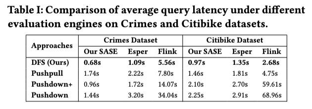

# Latex Writing

不可否认,现在大模型能够极大辅助论文写作,缓解写作压力,然而,个人认为大模型不能以很好的逻辑讲好故事,而且生成的内容有些完全是胡编乱造凑字数而已,一点不精简优美.
**论文全文一定要自己先用英文写出来,把逻辑理顺,再丢大模型检查语法+润色.** 把大模型视为一个辅助工具,不依赖大模型,反复思考打磨论文语句,如此写作思维与写作水平才能大幅提升.

## 写作前

### 常见缩写

| 缩写   | 全称            |
| ------ | --------------- |
| i.e.   | in other words  |
| e.g.   | for example     |
| etc.   | and so on       |
| w.r.t. | with respect to |

可用用`newcommand`命令去生成一个全局的变量.方法也是如此,这样以后万一需要改方法名字时,能快速更改过来.
```
\newcommand{\ie}{\textit{i.e.}\xspace}
\newcommand{\eg}{\textit{e.g.}\xspace}
\newcommand{\etc}{\textit{etc.}\xspace}
\newcommand{\etal}{\frenchspacing{}\emph{et al{.}}\xspace}
```
然后正文直接使用对应的命令即可,比如
In addition, EC has a minimum size requirement (\ie, when the stripe unit is 4 KiB, EC(4,2) requires at least 16 KiB) and thus can result in significant write amplification, especially for small I/O requests.


## 写作中
一般来说,应该先写方法,再做实验,最后写引言摘要.个人认为只有非常懂文章的三个新颖贡献才能最开始写引言.

### 摘要写作逻辑
- **问题**:做的是什么？应用在哪？
- **动机**:之前方法存在什么问题？
- **方法**:使用了什么技术解决这个问题(不应过细，突出要点)
- **效果**:与对比方法相比性能如何? (只要是突出你针对提出的问题所做的优化的性能都能写进来)

**例子(SOSP某篇文章的摘要)**
`RAG (Retrieval Augmented Generation) allows LLMs (large language models) to generate better responses with external knowledge, but using more external knowledge causes higher response delay. Prior work focuses either on reducing the response delay (e.g., better scheduling of RAG queries) or on maximizing quality (e.g., tuning the RAG workflow), but they fall short in systematically balancing the tradeoff between the delay and quality of RAG responses. To balance both quality and response delay, this paper presents METIS, the first RAG system that jointly schedules queries and adapts the key RAG configurations of each query, such as the number of retrieved text chunks and synthesis methods. Using four popular RAG-QA datasets, we show that compared to the state-of-the-art RAG optimization schemes, METIS reduces the generation latency by 1.64 − 2.54× without sacrificing generation quality.`

这个摘要思路：xxx技术可以用来干xxx（好处）？但是引入了xxx问题。之前工作怎么解决的，存在什么问题？因此，我们提出了xxx去做/解决xxx。达到了xxx效果。

### 引言写作逻辑
- 做的是什么(大概背景),一定要突出重要性
- 之前方法为什么不行？即**gaps或者challenges在哪**？(举例子，或者给出实验图)
- 如何创新解决gaps和challenges?关键的Insight和Intuition要讲明白
- 本文贡献点：新问题、新方法、理论保障、丰富的实验(除实验应该还要有3个贡献)

### 全文写作逻辑
- 新手写作时刻要遵循总分逻辑去写作,这样能确保逻辑连贯,即首先介绍这一章大致内容(即每小节的内容的概括),然后再分开讲述每小节内容
- 如果上一句的主语和当前主语不一致,则需要连接词使逻辑顺畅
    - **表示转折**: although, however, on the contrary, in spite of, yet, despite, but, nevertheless, otherwise, unfortunately, albeit
    - **表示并列/递进**: and, more than that, likewise, in addition, for instance/example, also, moreover, furthermore, what is more, intuitively, concretely, specifically, empirically, specially, lastly, remarkably, in essence, intrinsically
    - **表示因果**: as a result, because, thus, so, as, since, therefore, consequently, on account of, ultimately
    - **表示归纳**: as a result, finally, therefore, thus, accordingly, in short, consequently, in conclusion, so, in a word, in brief, certainly, in a nutshell, overall
- 分点让逻辑更清晰
    - Our technique can improve XXX for three reasons. First, xxx. Second, xxx. Third, xxx.
    - We investigate such xxx and discover three reasons: (1) xxx; (2) xxx; and (3) xxx.
- 理由要精炼得体,下列语句是摘抄自A类文章,[更多摘抄语句](sentences.md)
    - Since xx is not open-source, we implement xx from scratch faithfully following the original design principles, as well as caching the top-level nodes on compute nodes for better performance.
    - Since then, both the hardware and workload landscapes have changed.
- 描述性的量词: massed, dozens of, divers, plenty, vast, enormous, immense
- 实验说明相关动词: evaluate, provide, report, vary, measure, reveal, observe
- 善用强描述性的形容词/副词: prohibitively expensive

### 实验
- 实验设置:软硬件环境、实验数据、对比算法、性能指标
- Effectiveness Study:对比验证方法有效性(Micro/Macro experiments)
- Efficiency/Scalability Study:对比验证方法计算效率
- 外部因素:验证实验环境、对象、参数对方法的影响
- 内部因素:验证方法各个步骤的作用
- Case Study:常用于真应用场景下考察方法的表现

注意:实验一定要全面(全方位、系统化地进行实验验证)+深刻(深入讨论、分析实验结果的成因)

### 公式
- 数学符号: [A short list of commonly used LATEX symbols](https://artofproblemsolving.com/wiki/index.php/LaTeX:Symbols)
- 公式如果太长,可以用`\hsapce{-0.1em}`或者在两个符号中间加`\!`
- 需编号,**结尾有标点**(下文接where用逗号,没有则用句号),不超宽,等号对齐

### 图表(通常放在论文最顶/底端)
- 算法. 建议使用[algorithm2e package](https://www.ctan.org/pkg/algorithm2e)
- 图片, 见[画图项目](https://github.com/Josehokec/python_figure).
- 表格. 初学者生成表格可以参考[Tables Generator](https://www.tablesgenerator.com)和[Latex-tables](https://www.latex-tables.com)

注意：图标字体统一，字号不大于正文、也不宜过小，标题、图例和坐标轴表达清楚，配色美观

```
%% \usepackage{tabularray}     % 记得导入有关包
\begin{table}
\caption{Comparison of average query latency under different evaluation engines on Crimes and Citibike datasets.}
\addvspace{-1em}
\label{tab:engine_latency}
\centering
\scalebox{0.7}{
\begin{tblr}{
  rowsep=0.8pt,                 % 设置行间距
  cell{1}{1} = {r=2}{},         % 第1行第1列跨2行
  cell{1}{2} = {c=3}{c},        % 第1行第2列跨3列
  cell{1}{5} = {c=3}{c},        % 第1行第5列跨3列
  vline{1, 2, 5, 8} = {1-6}{},  % 在第1-4行，第2和第6列前加垂线
  hline{1,3,7} = {-}{},         % 在第1、3、8行画水平线。
  hline{2} = {2-7}{},           % 水平线画到第2到7列
}
{\bf Approaches}    &{\bf Crimes Dataset}&& & {\bf Citibike Dataset} &     \\
 &{\bf Our SASE}    &{\bf Esper}&{\bf Flink}& {\bf Our SASE}& {\bf Esper}  & \textbf{Flink} \\
\textbf{DFS (Ours)} &{\bf0.68s} &{\bf1.09s} &{\bf5.56s}     &{\bf 0.97s}   & {\bf 1.35s} & {\bf2.68s}\\
\textbf{Pushpull}   & 1.74s     & 2.22s     & 7.80s         & 1.46s & 1.81s & 4.75s\\
\textbf{Pushdown+}  & 0.96s     & 1.72s     & 14.07s        & 2.10s   & 2.70s & 59.61s\\
\textbf{Pushdown}   & 1.44s     & 3.20s     & 34.04s        & 2.25s   & 2.91s & 68.96s
\end{tblr}
}
\end{table}
```
<center class ='img'>

</center>  


### 排版
- 标题和子标题单词首字母大写(介词除外)
- 如果首行字体加粗了,后续内容不应该出现加粗,用下划线或者斜体替代
- 下划线推荐使用`\usepackage[normalem]{ulem}`,normalem参数能避免给参考文献加下划线

### 引用格式
- 正常来说,去掉引用不应该影响句子的完整性,此外一般我喜欢在引用前加波浪线,如`~\cite{Paper1}`
- 在[dblp](https://dblp.org/)上去寻找获取论文BibTeX,注意:每年论文导入的Bib风格不一样,需要自己修改统一,如会议是否缩写、会议地点、出版社名
- 标题中需要强制大小写的单词用 {...} 括起来，例如 {RDF}、{DBpedia}
- 个人不喜欢使用"xxx等人[引用]提出yyy方法"这种描述,更喜欢"xxx特征的方法去解决yyy问题[引用]"这样的表述.当然,为避免审美疲劳,两种表述方法都可使用,但更要偏向后者

## 写作后
对照[快速检查列表](check_list.md)检查

## 参考文献
http://ws2.nju.edu.cn/kgwiki/doku.php?id=team:writing
